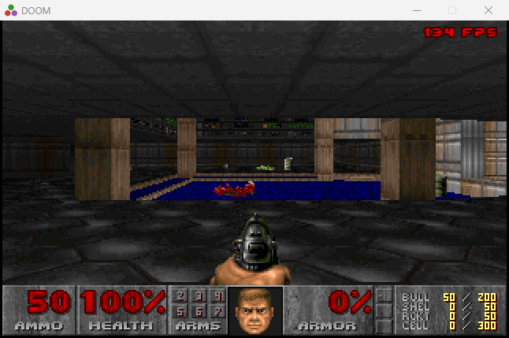

# julia_doom



**Video:** [DOOM running in Julia](https://youtu.be/jITQFpVyCeA)

**Repository:** [github.com/vagucs/julia_doom](https://github.com/vagucs/julia_doom)

DOOM generic ported from **[python_doom](https://github.com/vagucs/python_doom)** to **Julia + SDL2**.

By **Wagner Nunes da Silva**

- vagucs@bol.com.br
- vagucs@vagucs.com.br
- vagucs@gmail.com
- [www.vagucs.com.br](https://www.vagucs.com.br)
- [LinkedIn](https://www.linkedin.com/in/wagner-nunes-da-silva-b0a15360)

This tree is that Python engine again, in Julia. The game loop, the map, and the renderer stay in Julia. `ccall` talks to `SDL2.dll` for the window, the keyboard, the mouse, and the PCM queue. There is no C renderer. Windows MCI plays the MIDI, because SDL2 does not.

Versão em português: [README.pt.md](README.pt.md)

---

## What this project is

`python_doom` is a condensed, playable DOOM engine in Python. This directory is the **same study piece**, rewritten in Julia:

- Window, keys, mouse, PCM: **SDL2**, reached from Julia with `ccall`
- Framebuffer: 320×200, one PLAYPAL index per byte (`Vector{UInt8}` of 64000), stretched to a 640×400 window
- Game tick: 35 Hz (`TICRATE`). Each displayed frame runs up to 4 tics
- Renderer: BSP, visplanes, columns, spans, sprites, the weapon sprite
- Map: VERTEXES, LINEDEFS, SIDEDEFS, SECTORS, SEGS, SSECTORS, NODES, THINGS, BLOCKMAP, REJECT
- Play: walk, doors, lifts, switches, exit, pickups, weapons, status bar, Tab automap, DS* sound, MUS→MIDI music, ESC menu, intermission tally, melt wipe on a level change, monster look/chase/attack, mouse look

You need a legal IWAD (shareware `doom1.wad` or commercial `doom.wad` / `doom2.wad`). This repository does not ship commercial WAD data.

It is a **condensed educational port**: the engine is Julia, the native layer is only SDL2 and the Windows MIDI call.

Left out of this tree:

- Network, joystick, CD audio

---

## Educational purpose

This project is a **study piece**. The Python port already dropped the preprocessor and Harbour's 1-based arrays. The Julia port asks a different question: **what changes when the language has real 32-bit wrap, 1-based arrays, and `ccall` instead of pygame**.

What it is meant to teach:

- **Python, then Julia.** Open `python_doom/doom/` next to `julia_doom/src/`. The names stay close (`thrust!`, `fixed_mul`, `line_attack`) so the two files can sit side by side.
- **32-bit wrap, already in the type.** `Int32` and `UInt32` wrap. A bare `Int` is `Int64`, so game math goes through `as_i32` / `as_u32`. `fixed_mul` widens to `Int64` and comes back. `fixed_div` uses floor division, like Python `//`.
- **1-based reads.** WAD lumps, BSP nodes, menu rows, and screen columns stay 0-based in the data and are read with `+ 1`.
- **Where Julia is enough.** Columns, floors, sprites, thinkers, and the CRT scanlines run in Julia. SDL2 is the window, the keyboard, the mouse, and the PCM queue.

Suggested way to study:

1. Run `run.bat`, then read `run.jl` and `src/game.jl` — boot, tic, input.
2. Compare `src/compat.jl` with `python_doom/doom/compat.py`.
3. Open `src/render.jl` next to `python_doom/doom/render.py`.
4. Follow a door from **Space** (`use_lines` in `src/collision.jl`) through `src/specials.jl`.
5. Follow a shot from **Ctrl** in `src/player.jl` to `spawn_player_missile` in `src/enemy.jl`.

---

## From Python to Julia

Python lists are 0-based. Julia arrays are 1-based. WAD lumps, BSP nodes, menu rows, and clip ranges stay 0-based in the data and are read with `+ 1`.

| Python (`python_doom`) | Julia (`julia_doom`) |
| --- | --- |
| `thing.x` | `thing.x` |
| `None` | `nothing` |
| `items[0]` | `items[1]` |
| class | `mutable struct` (shared reference) |
| unlimited `int` | `Int32` / `UInt32` wrap; a bare `Int` is `Int64` |
| `&`, `\|`, `^` | `&`, `\|`, `⊻` on `UInt32`, or `band` / `bor` / `bxor` |
| `x >> n` | `ushr` / `shar` |
| `fixed_mul` / `fixed_div` | `fixed_mul` / `fixed_div` (`fld`, same as `//`) |
| `bytearray` framebuffer | `Vector{UInt8}`, one palette index per pixel |
| pygame | SDL2 through `ccall` |
| `(-1) % n` floors | `(-1) % n` is negative; `mod` floors |
| `if 0` | a type error; compare `!= 0` |

`0` is not a boolean. A field update on a `mutable struct` is visible to the caller, the same way a Python object is.

### Side-by-side: `P_Thrust`

Python (`doom/player.py`):

```python
def thrust(mo, angle, move):
    mo.momx += fixed_mul(move, fine_cos(angle))
    mo.momy += fixed_mul(move, fine_sin(angle))
```

Julia (`src/player.jl`):

```julia
function thrust!(mo, angle, move)
    mo.momx += Int(fixed_mul(move, fine_cos(angle)))
    mo.momy += Int(fixed_mul(move, fine_sin(angle)))
    nothing
end
```

`.` stays `.`. `mo` is a mutable struct, so the new momentum stays on the mobj the caller already holds. The `!` marks that mutation. `Int(...)` writes the product back at the field width.

---

## Technology

| Layer | This port | Python (`python_doom`) |
| --- | --- | --- |
| Language | Julia 1.13 (`run.bat` uses the juliaup executable) | Python 3.10+ |
| Window, keys, mouse, PCM | SDL2, `ccall` into `SDL2.dll` | pygame 2.x |
| Palette blit / CRT | Julia, then `SDL_UpdateTexture` | numpy |
| MIDI (Windows) | winmm `mciSendStringW` | the same idea, outside pygame |
| IWAD | the same lumps | the same lumps |
| Build | none (`run.bat` or `julia --project=. run.jl`) | `pip install -r requirements.txt` |

The renderer is Julia. There is no C file to compile.

---

## How to run

From this directory, on Windows:

```
run.bat
run.bat -iwad ..\DOOM1.WAD
run.bat -fps -warp 1 1
run.bat -crt
run.bat -novsync
```

`run.bat` puts `C:\msys64\ucrt64\bin` on `PATH` and starts Julia 1.13. The window opens at 640×400. Without `-crt`, the 320×200 texture is stretched with nearest-neighbor. `-novsync` asks SDL to present without waiting for the monitor and skips the 1 ms pause between polls.

With no `-iwad`, the loader looks for `DOOM1.WAD` in this folder and in the parent.

---

## Keys

Classic DOOM controls.

### Movement and actions

| Key | Action |
| --- | --- |
| Arrow keys | Forward, back, turn |
| **Shift** | Run |
| **Alt** | Strafe (hold) |
| **Ctrl** or left mouse | Fire |
| **Space** / **E** | Use / open door |
| Mouse | Look |
| **Enter** / **Esc** | Menu |
| **Tab** | Automap. **F** follows, **G** draws the grid, **0** shows the whole map |
| **-** / **=** | Zoom the automap when it is open; otherwise a smaller / larger 3D view |
| **F11** | Toggle the frame rate |
| **Alt+Enter** | Fullscreen |

Closing the window exits. **Y** confirms quit from the menu.

### Cheats

Type these during a level, with the menu closed. No Enter. On Nightmare skill only **IDCLEV** and **IDDT** are accepted.

| Code | Effect |
| --- | --- |
| **IDDQD** | God mode |
| **IDKFA** | All weapons, ammo, keys, and armor |
| **IDFA** | Weapons, ammo, and armor |
| **IDCLIP** / **IDSPISPOPD** | No clipping |
| **IDDT** | Automap: all walls, then things |
| **IDBEHOLD** | Power-ups; then **V** **S** **I** **R** **A** **L** |
| **IDCHOPPERS** | Chainsaw |
| **IDMYPOS** | Coordinates and angle |
| **IDCLEV** + 2 digits | Warp (`11` = E1M1, or MAP11 on a commercial IWAD) |
| **IDMUS** + 2 digits | Change music |

`-nocheats` turns the codes off.

---

## Command-line parameters

### IWAD

| Parameter | Description |
| --- | --- |
| `-iwad file.wad` | IWAD to load |
| `file.wad` | Same thing, without `-iwad` |
| `-file wad [wad…]` | Extra PWADs after the IWAD |

### Video

| Parameter | Description |
| --- | --- |
| `-crt` | Scanlines, drawn in Julia over the SDL texture |
| `-fps` | Frame rate at the top-right. The game still ticks at 35 Hz |
| `-novsync` | Present without waiting for the monitor, and skip the 1 ms pause |

### Game

| Parameter | Description |
| --- | --- |
| `-warp e m` | Skip the title and start episode `e` map `m` |
| `-skill n` | Skill |
| `-nomonsters` | Do not spawn enemies |
| `-fast` | Faster monsters |
| `-respawn` | Nightmare-style respawn |
| `-nosound` | No sound effects |
| `-nomusic` | No MIDI |
| `-nocheats` | Ignore cheat codes |

A level change melts the screen. Starting a new game from the title does not. Shareware map 8 writes the episode text on `FLOOR4_8`. Saves are `doomsavN.dsg` next to the IWAD, with the header `DOOMPY01`.

---

## Layout

```
run.jl               entry
run.bat              PATH, then Julia
src/                 engine
screenshot/doom.png  the picture at the top
```

| Path | Python |
| --- | --- |
| `src/compat.jl` | `doom/compat.py` |
| `src/wad.jl` | `doom/wad.py` |
| `src/video.jl` | `doom/video.py` |
| `src/v_video.jl` | `doom/v_video.py` |
| `src/tables.jl` | `doom/tables.py` |
| `src/r_data.jl` | `doom/r_data.py` |
| `src/render.jl` | `doom/render.py` |
| `src/world.jl` | `doom/world.py` |
| `src/collision.jl` | `doom/collision.py` |
| `src/player.jl` | `doom/player.py` |
| `src/specials.jl` | `doom/specials.py` |
| `src/info.jl` | `doom/info.py` |
| `src/sprites.jl` | `doom/sprites.py` |
| `src/enemy.jl` | `doom/enemy.py` |
| `src/thinker.jl` | `doom/thinker.py` |
| `src/status.jl` | `doom/status.py` |
| `src/sound.jl` | `doom/sound.py` |
| `src/mus2mid.jl` | `doom/mus2mid.py` |
| `src/menu.jl` | `doom/menu.py` |
| `src/wi_stuff.jl` | `doom/wi_stuff.py` |
| `src/wipe.jl` | `doom/wipe.py` |
| `src/cheats.jl` | cheat machine in `doom/game.py` |
| `src/am_map.jl` | `doom/am_map.py` |
| `src/finale.jl` | `doom/finale.py` |
| `src/saveg.jl` | `doom/saveg.py` |
| `src/game.jl` | `doom/game.py` |
| `run.jl` | the Python entry |

---

## Lineage

1. **[python_doom](https://github.com/vagucs/python_doom)** — Python + pygame
2. **[julia_doom](https://github.com/vagucs/julia_doom)** — Julia + SDL2 (this tree)

---

## Donate

### GitHub Sponsors

[github.com/sponsors/vagucs](https://github.com/sponsors/vagucs)

### Ethereum

`0x1b64038A2b1DB73ABd0068d8B9B0d1dC5a90C5F1`


### PIX

Key: `vagucs@bol.com.br`


